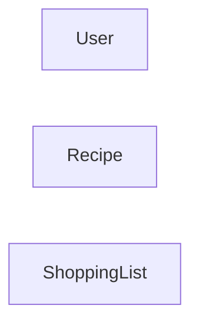

## Tại sao cần file này
File này giữ cho dữ liệu bám đúng những gì sản phẩm thật sự cần nhớ. Nếu không chốt sớm, dự án rất dễ bịa thêm entity không phục vụ tính năng nào nhưng vẫn làm kiến trúc nặng lên.

## Thực Thể Chính
User, Recipe, ShoppingList
<!-- anchor: id=03-data-model/core-entities  src=src/features/data-model/dataModel.ts::coreEntities  rev=  status=planned -->

## Quan Hệ Giữa Các Thực Thể
User, Recipe, ShoppingList
<!-- anchor: id=03-data-model/entity-relationships  src=src/features/data-model/dataModel.ts::entityRelationships  rev=  status=planned -->

## Sơ Đồ Quan Hệ Dữ Liệu

Sơ đồ vẽ lại đúng quan hệ bạn đã mô tả, **chưa khai cardinality** (một-một, một-nhiều, nhiều-nhiều) vì phần đó chưa được chốt trong phỏng vấn. Khi dựng schema thật ở milestone M0, bổ sung cardinality vào đây — đó là lúc bạn biết chắc.
<!-- anchor: id=03-data-model/diagram  src=src/features/data-model/dataModel.ts::dataModelDiagram  rev=  status=planned -->

## Ghi Chú Về Phần Chưa Đưa Vào MVP
User, Recipe, ShoppingList
<!-- anchor: id=03-data-model/deferred-data  src=src/features/data-model/dataModel.ts::deferredDataNotes  rev=  status=planned -->
