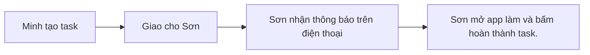

## Tại sao cần file này
File này biến danh sách tính năng thành một lần dùng thật từ đầu tới cuối. Nếu flow không trơn, rất có thể scope hoặc data model vẫn chưa chốt đúng.

## Luồng Điển Hình
Minh tạo task -> Giao cho Sơn -> Sơn nhận thông báo trên điện thoại -> Sơn mở app làm và bấm hoàn thành task.
<!-- anchor: id=04-flows/main-flow-summary  src=apps/mobile/src/features/flows/flows.ts::mainFlowSummary  rev=  status=planned -->

## Các Bước Chính
Minh tạo task -> Giao cho Sơn -> Sơn nhận thông báo trên điện thoại -> Sơn mở app làm và bấm hoàn thành task.
<!-- anchor: id=04-flows/main-flow-steps  src=apps/mobile/src/features/flows/flows.ts::mainFlowSteps  rev=  status=planned -->

## Sơ Đồ Luồng Chính

Đây là luồng chính — cũng chính là thứ phải chạy được end-to-end ở milestone M0 (xem `08-build-plan.md`). Mỗi lần xong một milestone, chạy lại đúng luồng này như một người dùng thật.
<!-- anchor: id=04-flows/diagram  src=apps/mobile/src/features/flows/flows.ts::flowDiagram  rev=  status=planned -->

## Điểm Dễ Vỡ Hoặc Cần Làm Rõ
Minh tạo task -> Giao cho Sơn -> Sơn nhận thông báo trên điện thoại -> Sơn mở app làm và bấm hoàn thành task.
<!-- anchor: id=04-flows/flow-risks  src=apps/mobile/src/features/flows/flows.ts::flowRisks  rev=  status=planned -->
